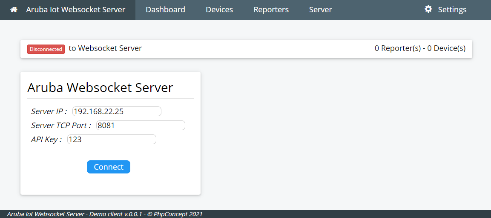
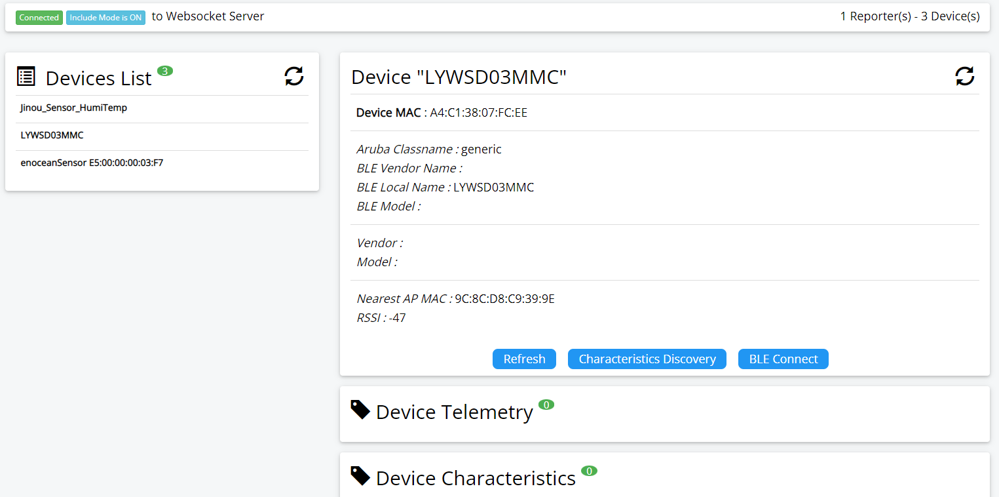
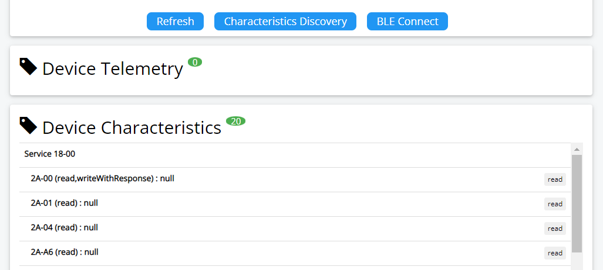
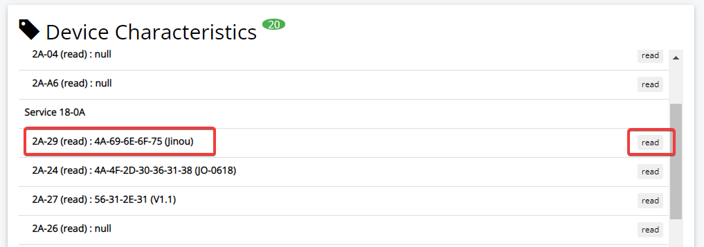
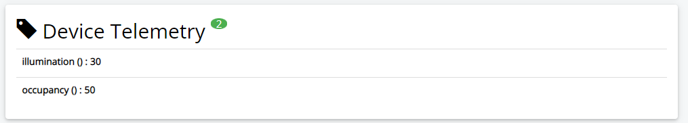
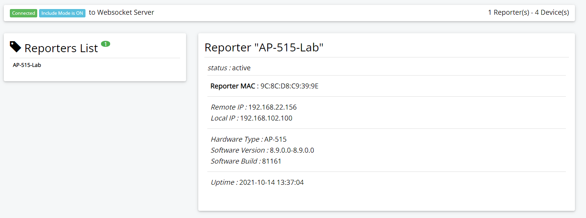
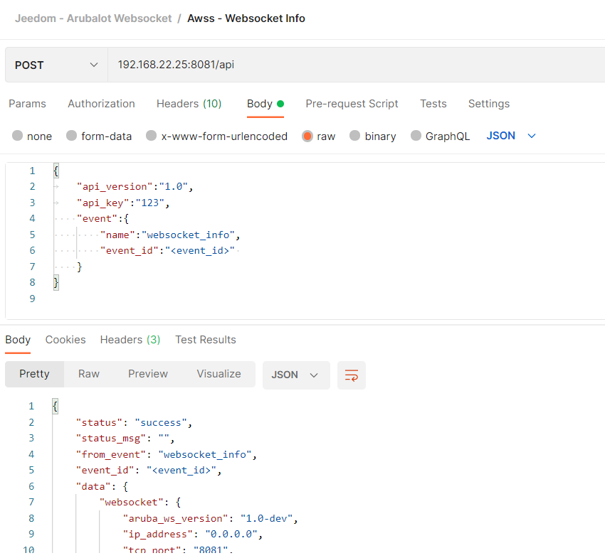
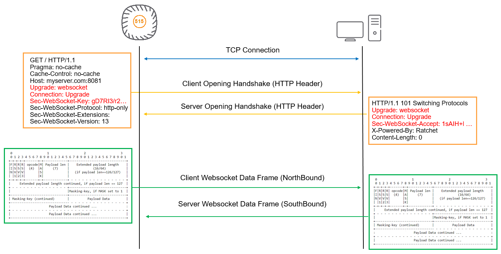
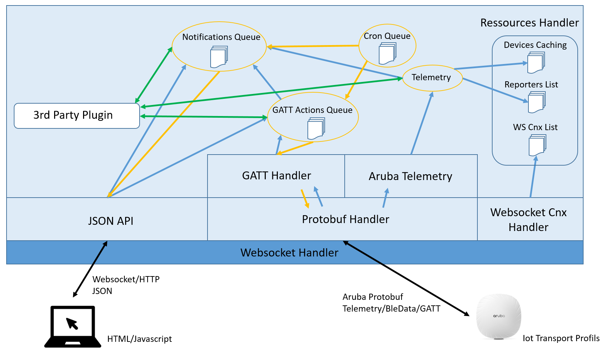

# Aruba IoT Demonstration Websocket Server

aruba-ws-server is a websocket server, written in PHP, to test and demonstrate the IoT capabilities of Aruba Access Points.
Today it supports only the BLE capabilities of Aruba AP.

## Quick Start Guide

### Install on Linux Debian

The Aruba Websocket Server (AWSS) was developed and tested on a Linux Debian 10 (Buster) with PHP 7.3. So you need to install it on a compatible linux system with installed PHP libraries.

#### Pre-requisit

The installation will use existing libraries and packages already available on internet. Key packages are:
- Ratchet : A PHP library for asynchronously serving WebSockets (https://github.com/ratchetphp/Ratchet),
- Protobuf : Protobuf for PHP is an implementation of Google's Protocol Buffers for the PHP language (https://github.com/protobuf-php/protobuf)

The installation will also use development tools and frameworks, like “composer” (https://getcomposer.org/), which is a package installer for PHP libraries, and “protobuf-compiler” (https://packages.debian.org/en/jessie/protobuf-compiler) which will be used to generate the PHP classes from the protobuf description files. 

#### Step by step install

- Install Composer (if not already installed)

```cli
apt-get install composer
```

- Download the full source code (from github)
- Unzip the content
- Change folder name (if needed)
- Move to the websocket folder

```cli
wget https://github.com/phpconcept/aruba-ws-server/archive/refs/heads/beta.zip
unzip beta.zip
mv aruba-ws-server-beta websocket
```

- use composer to download the additional libraries

```cli
composer install
```

- You should have an additional "vendor/" folder in your directory

- Test your installation 

```cli
php aruba-ws-server.php -help
```

#### Starting Websocket Server

To start the websocket server :

```cli
php aruba-ws-server.php -api_key <your_api_key>
```

Or, if you want to see the debug :

```cli
php aruba-ws-server.php -console_log -api_key <your_api_key>
```

For more parameters (some may not be yet implemented :-) ) :
```cli
php aruba-ws-server.php -help
-----
aruba-ws-server.php [-help] [-console_log] [-server_ip X.X.X.X] [-server_port XXX] [-api_key XXX] [-reporters_key XXX] [-reporters_list X1,X2,X3...] [-devices_list X1,X2,X3...] [-display_ping] [-display_raw_data] [-file <debug_message_filename>]
-----
```

### Install on Docker

The Aruba Websocket Server (AWSS) can be used as a Docker container. The Docker image must be created before the server can be started.

Docker must be installed on your system (see Docker documentation).


#### Build the Docker Image for AWSS

To build a Docker image, you need to have a "Dockerfile" which describes how to create the container image.

The proposed Dockerfile is :

```cli
# ----- Meta infos
LABEL version="1.0" maintainer="Vincent Blavet <vincent@phpconcept.net>"

# ----- Temp variables
ARG APT_FLAGS="-q -y"
ARG DOCUMENTROOT="/var/www/html"

# ----- Default value for environment args
ENV AWSS_ARGS="-console_log -api_key 123"

# ----- Working folder
WORKDIR  ${DOCUMENTROOT}

# ----- Install Linux packages
RUN apt-get update 
RUN apt-get install ${APT_FLAGS} --no-install-recommends \
    php composer wget unzip && \
    rm -f ${DOCUMENTROOT}/index.html && \
    apt-get autoclean -y && \ 
    rm -rf /var/lib/apt/lists/* 

# ----- Build variables
# Branch type could be : heads or tags
ARG BRANCH_TYPE="heads"
ARG BRANCH_NAME="main"

# ----- Download and install Aruba Websocket Server (from github branch)
RUN wget https://github.com/phpconcept/aruba-ws-server/archive/refs/${BRANCH_TYPE}/${BRANCH_NAME}.zip && \
    unzip *.zip && \
    rm -f *.zip && \
    mv aruba-ws-server-* websocket

# ----- Install Ratchet and Protobuf PHP libraries
RUN composer install -d ${DOCUMENTROOT}/websocket

# ----- Working folder
WORKDIR  ${DOCUMENTROOT}/websocket

# ----- Expose TCP Port for wss
EXPOSE 8081

# ----- Start websocket server
ENTRYPOINT php aruba-ws-server.php $AWSS_ARGS
```

This file can be downloaded in the folder "doc/install/install_docker/" of the github repository. 

Put the Dockerfile (with the exact name of Dockerfile) in your working Docker directory.

To launch the build of the Docker image for the "main" github branch, use the following comamnd :

```cli
docker build --build-arg BRANCH_NAME=main -t aruba_wss:main .
```

To launch the build of the Docker image for the "beta" github branch, use the following comamnd :

```cli
docker build --build-arg BRANCH_NAME=beta -t aruba_wss:beta .
```

To launch the build of the Docker image for a tagged version of the code, use the following comamnd :

```cli
docker build --build-arg BRANCH_TYPE=tags --build-arg BRANCH_NAME=v1.0 -t aruba_wss:v1.0 .
```

As a quick summary, the Docker build will download a Docker image containing a light version of Debian Buster, will install 
the needed packages (PHP, ...), will download the latest code from the github repository, will install the needed PHP libraries 
(Ratchet, Protobuf, ...) and will launch the websocket server.
 
#### Starting Websocket Server in Docker Container

To start the websocket server in the Docker container, use the following command :

```cli
docker run -p 8081:8081 -e AWSS_ARGS="-console_log -api_key hello" --name awss aruba_wss:main
```

You can customize the arguments send to the server with the environment variable AWSS_ARGS, and select the image to use : aruba_wss:main or aruba_wss:beta.
To change the listening TCP port change the mapping with argument -p 8081:8081.

### Aruba Access Point Configuration

Below is an example of an Aruba Access Point (IAP mode) configuration (AOS version 8.9) to have the IOT Gateway sending telemetry data to websocket server.

Please notice that URI "/telemetry" is used for the endpointURL. For all other attributes of the transportProfile, please refer to Aruba documentation. The right configuration will improve the load on the websocket server.


```cli
iot transportProfile Test
 endpointURL ws://<websocket_server_ip_address>:8081/telemetry
 endpointType telemetry-websocket
 payloadContent enocean-switches
 payloadContent enocean-sensors
 payloadContent unclassified
 endpointToken 12346
 transportInterval 30
 macOuiFilter A4C138,E6FE37

iot useTransportProfile Test
```

Above configuration will allow for Enocean BLE devices (sensors and switches), and for unclassified BLE devices which MAC address begins with A4:C1:38 or E6:FE:37.
Using the right filtering will lower the load on the Websocket Server.

### AWSS Client

As soon as the websocket server is launched, it can be accessed by a web browser using the URL : http://\<server_ip\>:8081
This will load a uniq HTML page including javascript to handle the websocket connection.
Connect to the websocket server by using the secret API key which was specified while launching the websocket.



## User Guide

### Introduction

Following sections are covering some of the keep info in order to use the demo server.

### Start Include Mode

Be default the websocket server will listen to the reception port, and will accept incoming connections from Access Points. However it will not by default on-board all discovered BLE devices. An include mode feature will allow to select which kind of devices are to be monitored.
To start the include mode from the client, connect to the server (if not already done), click on the "Start Include Mode" button.
You can also use the API, which allow for additional parameters.
After a while (the time for the first telemetry packet from the AP), the devices should be on-boarded.
The include mode can be stopped if needed.

### Display IoT Devices

From the client, select the "Device List" menu or button to display the list of discovered devices.



Click on the device in the list on the left to display the device informations. Click on "Refresh" button to download the latest informations on the device.

#### GATT BLE Connect/Disconnect/Read

The "Characteristics Discovery" button will start a GATT BLE connection to the device, and perform a discovery of all the BLE characteristics of the device. The wss will also terminate the BLE connection. A refresh will then display all the characteristics available.



When available, a click on the "read" button will read the characteristic value



Buttons "Connect" and "Disconnect" will allow for starting a manual BLE GATT connect/disconnect to the device. This is mainly to test the BLE connection to the device.
In normal case, discovery is a more efficient solution.

#### Aruba Telemetry

When the device is supporting Aruba Telemetry (known device classes), the telemetry payloads are received automatically at the frequency configured in the Access Point configuration. In this case the value of the attributes are also available.



Values depend on the device capabilities and the supported values from the websocket server.


### Display Reporters (Access Points)

The list of connected reporters is also available on the client. With some key informations (hardware type, uptime, version, ...).




### JSON API

The Websocket Server can be accessed by JSON API, in order to monitor or configure some of the properties. The prefered access method should be through a websocket connection rather than regular HTTP connection.
Most of the actions triggered by the server are asymetric actions, by using a websocket connection, actions results can be send to client when they are ready.

The JSON API is accessible using URL : http://\<server_ip\>:\<port\>/api. If not customized, default value for \<port\> is 8081.

You can use tools like Postman (https://www.postman.com/) to try and test the APIs.




#### General Format

General request format is :
```json
{
  "api_version":"1.0",        // mandatory : future use
  "api_key":"<api_key>",      // mandatory
  "event":{
    "name":"<event_name>",    // mandatory
    "event_id":"<event_id>",  // optional : uniq id to identifiy the request, used for async response like in websocket.
    "data": {                 // optional : event data depending on event
      "data_1":"value_1",
      "data_2":"value_2"
    }
  }
}
```

General response or notification format is :
```json
{
    "status": "success|fail",
    "status_msg": "<text_mesage>",
    "from_event": "<event_name>",
    "event_id": "<event_id>",
    "data": {
      "data_1":"value_1",
      "data_2":"value_2"
    }
}
```


#### API : Websocket Info

Get information regarding websocket status

Request :

```json
{
	"api_version":"1.0",
	"api_key":"<api_key>",
    "event": {
        "name":"websocket_info",
        "event_id":"<event_id>"
    }
}
```

Response (sample) :

```json
{
    "status": "success",
    "status_msg": "",
    "from_event": "websocket_info",
    "event_id": "<event_id>",
    "data": {
        "websocket": {
            "aruba_ws_version": "1.0-dev",
            "ip_address": "0.0.0.0",
            "tcp_port": "8081",
            "up_time": 1631885139,
            "presence_timeout": 90,
            "presence_min_rssi": -90,
            "presence_rssi_hysteresis": 5,
            "nearest_ap_hysteresis": 5,
            "nearest_ap_timeout": 90,
            "nearest_ap_min_rssi": -90,
            "reporters_allow_list": "",
            "access_token": "",
            "reporters_nb": 0,
            "devices_nb": 0,
            "include_mode": 0,
            "include_device_count": 0,
            "device_type_allow_list": "",
            "include_generic_with_local": 0,
            "include_generic_with_mac": 0,
            "include_generic_mac_prefix": "",
            "include_generic_max_devices": 3,
            "stats": {
                "payload_data": 0,
                "raw_data": 413
            },
            "gatt_queue_nb": 0
        }
    }
}
```

#### API : Device List

Request :

```json
{
	"api_version":"1.0",
	"api_key":"123",
    "event":{
        "name":"device_list",
        "event_id":"<event_id>",
        "data": {
          "extended":1
        }
    }
}
```

Response (sample) :

```json
{
    "status": "success",
    "status_msg": "",
    "from_event": "device_list",
    "event_id": "<event_id>",
    "data": {
        "devices": [
            {
                "mac": "E6:FE:37:0D:A4:D7",
                "name": "Jinou_Sensor_HumiTemp",
                "classname": "generic",
                "vendor_id": "Jinou",
                "model_id": "Sensor_HumiTemp",
                "nearest_ap_mac": "9C:8C:D8:C9:39:9E",
                "rssi": -49,
                "vendor_name": "",
                "local_name": "Jinou_Sensor_HumiTemp",
                "model": "",
                "presence": 1,
                "connect_status": "disconnected",
                "is_connectable": "unknown",
                "is_discoverable": "unknown",
                "services": [],
                "telemetry_values": []
            },
            {
                "mac": "A4:C1:38:07:FC:EE",
                "name": "LYWSD03MMC",
                "classname": "generic",
                "vendor_id": "",
                "model_id": "",
                "nearest_ap_mac": "9C:8C:D8:C9:39:9E",
                "rssi": -39,
                "vendor_name": "",
                "local_name": "LYWSD03MMC",
                "model": "",
                "presence": 1,
                "connect_status": "disconnected",
                "is_connectable": "unknown",
                "is_discoverable": "unknown",
                "services": [],
                "telemetry_values": []
            },
            {
                "mac": "E5:00:00:00:03:F7",
                "name": "enoceanSensor E5:00:00:00:03:F7",
                "classname": "enoceanSensor",
                "vendor_id": "Enocean",
                "model_id": "Sensor",
                "nearest_ap_mac": "9C:8C:D8:C9:39:9E",
                "rssi": -35,
                "vendor_name": "",
                "local_name": "",
                "model": "",
                "presence": 1,
                "connect_status": "disconnected",
                "is_connectable": "unknown",
                "is_discoverable": "unknown",
                "services": [],
                "telemetry_values": {
                    "illumination": {
                        "name": "illumination",
                        "type": "",
                        "value": 136,
                        "timestamp": 1631885797
                    },
                    "occupancy": {
                        "name": "occupancy",
                        "type": "",
                        "value": 50,
                        "timestamp": 1631885797
                    }
                }
            }
        ]
    }
}
```

#### API : Device Info


Request :

```json
{
	"api_version":"1.0",
	"api_key":"123",
    "event":{
        "name":"device_info",
        "event_id":"<event_id>",
        "data": {
          "device_mac":"E5:00:00:00:03:F7"
        }
    }
}
```

Response (sample) :

```json
{
    "status": "success",
    "status_msg": "",
    "from_event": "device_info",
    "event_id": "<event_id>",
    "data": {
        "device_mac": "E5:00:00:00:03:F7",
        "device": {
            "mac": "E5:00:00:00:03:F7",
            "name": "enoceanSensor E5:00:00:00:03:F7",
            "classname": "enoceanSensor",
            "vendor_id": "Enocean",
            "model_id": "Sensor",
            "nearest_ap_mac": "9C:8C:D8:C9:39:9E",
            "rssi": -35,
            "vendor_name": "",
            "local_name": "",
            "model": "",
            "presence": 1,
            "connect_status": "disconnected",
            "is_connectable": "unknown",
            "is_discoverable": "unknown",
            "services": [],
            "telemetry_values": {
                "illumination": {
                    "name": "illumination",
                    "type": "",
                    "value": 121,
                    "timestamp": 1631886158
                },
                "occupancy": {
                    "name": "occupancy",
                    "type": "",
                    "value": 50,
                    "timestamp": 1631886158
                }
            }
        }
    }
}
```


#### API : Reporters List


Request :

```json
{
	"api_version":"1.0",
	"api_key":"123",
    "event":{
        "name":"reporter_list",
        "event_id":"<event_id>"
    }
}
```

Response (sample) :

```json
{
    "status": "success",
    "status_msg": "",
    "from_event": "reporter_list",
    "event_id": "<event_id>",
    "data": {
        "websocket": {
            [... see above ...]
        },
        "reporters": [
            {
                "mac": "9C:8C:D8:C9:39:9E",
                "name": "AP-515-Lab",
                "local_ip": "192.168.102.100",
                "remote_ip": "192.168.22.156",
                "model": "AP-515",
                "version": "8.9.0.0-8.9.0.0",
                "telemetry": 1,
                "rtls": 0,
                "lastseen": 1631885947
            }
        ]
    }
}
```


#### API : Reporter Infos


Request :

```json


```

Response (sample) :

```json


```


#### API : Device Include Mode


Request :

```json


```

Response (sample) :

```json


```


#### API : Device Include Count


Request :

```json


```

Response (sample) :

```json


```


---


## Change Logs

Release v1.0-beta (in-dev) :
- Full update of the code from the initial websocket server
- Add support for GATT protocol
- Add support for API
- Add HTML/Javascript client to access the websocket server


## Known Caveats

As of Release v1.0, some known caveats are :
- /!\ Only ws:// is supported today by the websocket daemon, which means communication is in clear. No support yet of wss:// with certificate.

## WARNING :
 THE SOFTWARE IS PROVIDED "AS IS", WITHOUT WARRANTY OF ANY KIND, EXPRESS OR
 IMPLIED, INCLUDING BUT NOT LIMITED TO THE WARRANTIES OF MERCHANTABILITY,
 FITNESS FOR A PARTICULAR PURPOSE AND NONINFRINGEMENT. IN NO EVENT SHALL THE
 AUTHORS OR COPYRIGHT HOLDERS BE LIABLE FOR ANY CLAIM, DAMAGES OR OTHER
 LIABILITY, WHETHER IN AN ACTION OF CONTRACT, TORT OR OTHERWISE, ARISING FROM,
 OUT OF OR IN CONNECTION WITH THE SOFTWARE OR THE USE OR OTHER DEALINGS IN THE
 SOFTWARE.

## Credits

This demo server is using public available libraries, and their dependencies:
- ratchetphp/Ratchet : MIT License (https://github.com/ratchetphp/Ratchet/blob/master/LICENSE),
- protobuf-php/protobuf : MIT License (https://github.com/protobuf-php/protobuf/blob/master/LICENSE)


## Under The Hood

### Understanding Websocket Protocol for Aruba

This section is a short explanation of how the websocket protocol is working, and how Aruba is using it.

Aruba is following the RFC6455 (https://tools.ietf.org/html/rfc6455) for the definition of websocket dialog and use the protocol-buffers format (https://developers.google.com/protocol-buffers) to encode the transmitted frames.



The access point establish a TCP connection with the server. To perform an handshake, It sends an HTTP message with some mandatory field in the header (Upgrade, Connection and Sec-WebSocket-Key). The server must then answer with an HTTP response, including valid fields and a Sec-WebSocket-Accept key value calculated from the client one. This phase ends the handshake process between the two peers. TCP connection stay established, waiting for frames coming from either sides.

RFC6455 define the format of the frames exchanged between the client and the server. Regular “ping” and “pong” frames are also exchanged between the peers, waiting for data frames.

Data frames can be of various sizes, and large payloads can also be splitted on several frames.

The Ratchet library is taking care of all TCP, Handshake, frame creation and parsing of the websocket protocol.

In Aruba implementation, the payload transported in the websocket frames is in protocol-buffers (protobuf) binary format. In order to get access to the data, our demo server is using the PHP Protobuf library to decode/encode the Aruba Telemetry payloads.


### Server Software Architecture




## References

- Aruba IoT Basic Setup Guide :
https://support.hpe.com/hpesc/public/docDisplay?docId=a00100701en_us
- General information on Aruba IoT Solutions :
https://www.arubanetworks.com/iot 
- How to become an Aruba Technology Partner :
https://www.arubanetworks.com/partners/programs 
- WebSocket RFC6455 :
https://tools.ietf.org/html/rfc6455 
- Aruba Support Portal, for documentations, firmware downloads, Protocol-buffer description files, … :
https://asp.arubanetworks.com 


