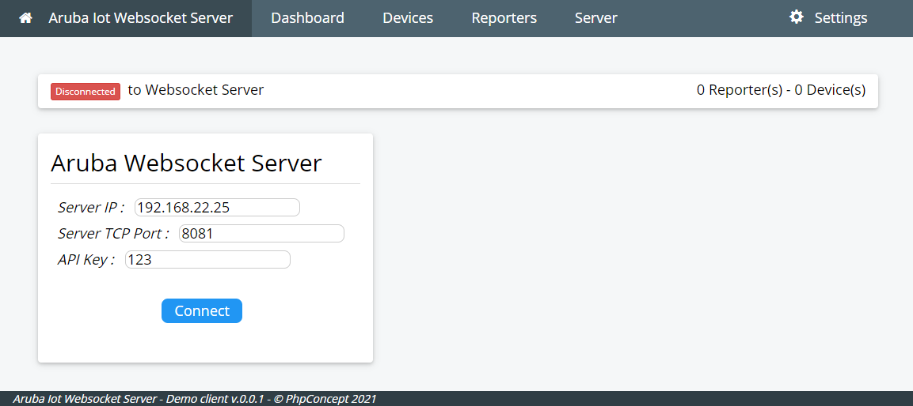
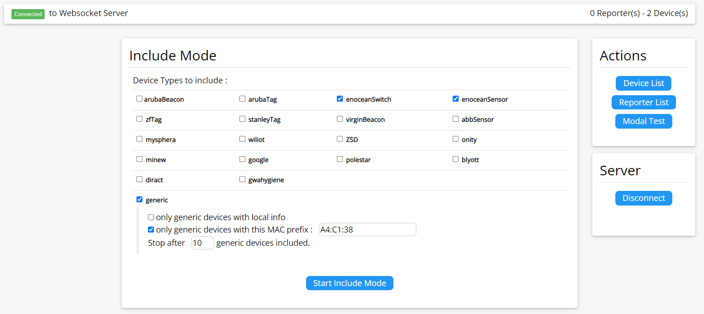
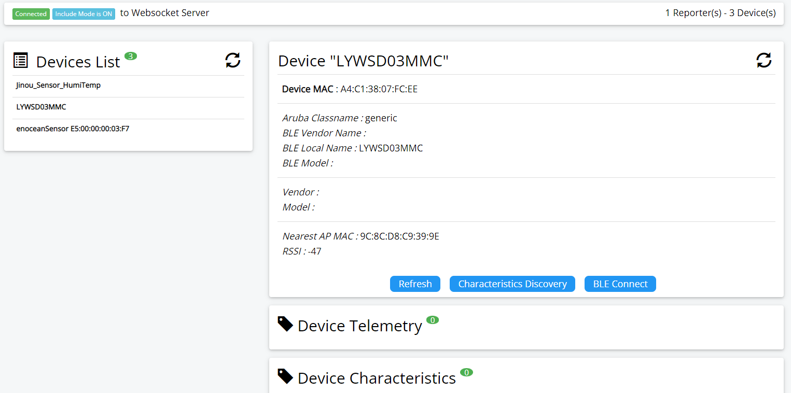
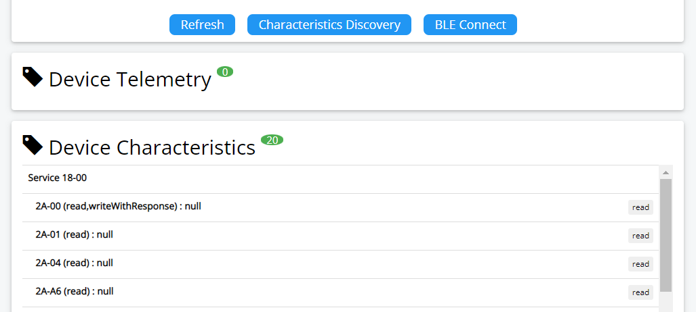
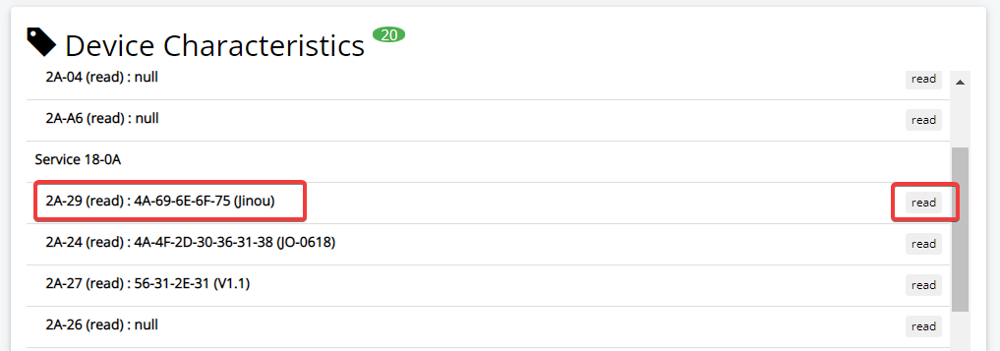
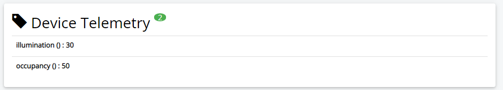
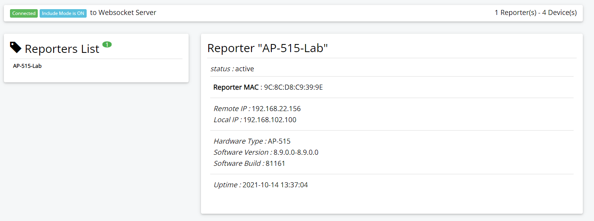
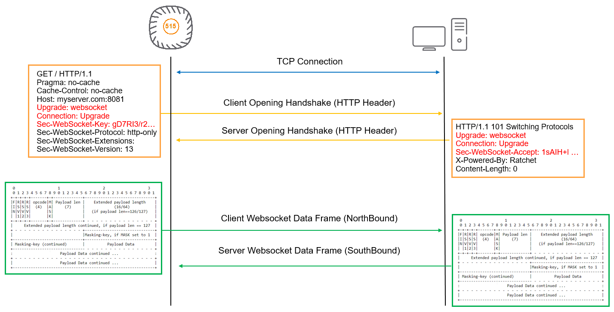
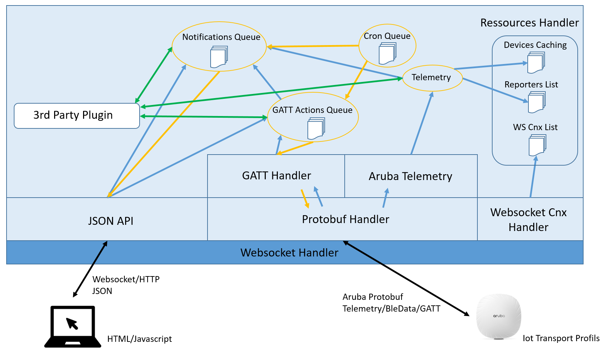

# Aruba IoT Demonstration Websocket Server

aruba-ws-server is a websocket server, written in PHP, to test and demonstrate the IoT capabilities of Aruba Access Points.

AWSS server is supporting Intant AP (IAP) and Controller (ArubaOS) based deployment model of the Access Points. 

Current features are focused on BLE IoT, but the server has capabilities to evolve in order to support Serial, Zigbee and RTLS.

## Quick Start Guide

You can install Aruba Websocket Server (AWSS) on linux, create a local Docker Container to run AWSS, or, easier, run a pre-built container hosted in Docker Hub.

### Run a AWSS container from Docker Hub

Docker containers are available on Docker Hub for published version of AWSS. You need to have a working Docker environment to run AWSS.

To start the websocket server in the Docker container, use the following command :

```cli
docker run -p 8081:8081 -e AWSS_ARGS="-console_log -api_key <your_api_key>" --name awss phpconcept/aruba_wss:main
```

You can customize the arguments send to the server with the environment variable AWSS_ARGS, and select the image to use : aruba_wss:main or aruba_wss:beta.
To change the listening TCP port change the mapping with argument -p 8081:8081.


### Install on Linux Debian

The Aruba Websocket Server (AWSS) was developed and tested on a Linux Debian 10 (Buster) with PHP 7.3. So you need to install it on a compatible linux system with installed PHP libraries.

#### Pre-requisit

The installation will use existing libraries and packages already available on internet. Key packages are:
- Ratchet : A PHP library for asynchronously serving WebSockets (https://github.com/ratchetphp/Ratchet),
- Protobuf : Protobuf for PHP is an implementation of Google's Protocol Buffers for the PHP language (https://github.com/protobuf-php/protobuf)

The installation will also use development tools and frameworks, like “composer” (https://getcomposer.org/), which is a package installer for PHP libraries, and “protobuf-compiler” (https://packages.debian.org/en/jessie/protobuf-compiler) which will be used to generate the PHP classes from the protobuf description files. 

#### Step by step install

- Install Composer (if not already installed)

```cli
apt-get install composer
```

- Download the full source code (from github)
- Unzip the content
- Change folder name (if needed)
- Move to the websocket folder

```cli
wget https://github.com/phpconcept/aruba-ws-server/archive/refs/heads/beta.zip
unzip beta.zip
mv aruba-ws-server-beta websocket
```

- use composer to download the additional libraries

```cli
composer install
```

- You should have an additional "vendor/" folder in your directory

- Test your installation 

```cli
php aruba-ws-server.php -help
```

#### Starting Websocket Server

To start the websocket server :

```cli
php aruba-ws-server.php -api_key <your_api_key>
```

Or, if you want to see the debug :

```cli
php aruba-ws-server.php -console_log -api_key <your_api_key>
```

For more parameters (some may not be yet implemented :-) ) :
```cli
php aruba-ws-server.php -help
-----
aruba-ws-server.php [-help] [-console_log] [-server_ip X.X.X.X] [-server_port XXX] [-api_key XXX] [-use_tls] [-cert_file /xxx/xxx.pem] [-cert_key_file /xxx/xxx.pem] [-reporters_key XXX] [-reporters_list X1,X2,X3...] [-devices_list X1,X2,X3...] [-display_ping] [-display_raw_data] [-file <debug_message_filename>]
-----
```

### Install on Docker

The Aruba Websocket Server (AWSS) can be used as a Docker container. The Docker image must be created before the server can be started.

Docker must be installed on your system (see Docker documentation).


#### Build the Docker Image for AWSS

To build a Docker image, you need to have a "Dockerfile" which describes how to create the container image.

The proposed Dockerfile is :

```cli
# ----- Meta infos
LABEL version="1.0" maintainer="Vincent Blavet <vincent@phpconcept.net>"

# ----- Temp variables
ARG APT_FLAGS="-q -y"
ARG DOCUMENTROOT="/var/www/html"

# ----- Default value for environment args
ENV AWSS_ARGS="-console_log -api_key 123"

# ----- Working folder
WORKDIR  ${DOCUMENTROOT}

# ----- Install Linux packages
RUN apt-get update 
RUN apt-get install ${APT_FLAGS} --no-install-recommends \
    php composer wget unzip && \
    rm -f ${DOCUMENTROOT}/index.html && \
    apt-get autoclean -y && \ 
    rm -rf /var/lib/apt/lists/* 

# ----- Build variables
# Branch type could be : heads or tags
ARG BRANCH_TYPE="heads"
ARG BRANCH_NAME="main"

# ----- Download and install Aruba Websocket Server (from github branch)
RUN wget https://github.com/phpconcept/aruba-ws-server/archive/refs/${BRANCH_TYPE}/${BRANCH_NAME}.zip && \
    unzip *.zip && \
    rm -f *.zip && \
    mv aruba-ws-server-* websocket

# ----- Install Ratchet and Protobuf PHP libraries
RUN composer install -d ${DOCUMENTROOT}/websocket

# ----- Working folder
WORKDIR  ${DOCUMENTROOT}/websocket

# ----- Expose TCP Port for wss
EXPOSE 8081

# ----- Start websocket server
ENTRYPOINT php aruba-ws-server.php $AWSS_ARGS
```

This file can be downloaded in the folder "doc/install/install_docker/" of the github repository. 

Put the Dockerfile (with the exact name of Dockerfile) in your working Docker directory.

To launch the build of the Docker image for the "main" github branch, use the following comamnd :

```cli
docker build -t aruba_wss:main .
```

To launch the build of the Docker image for the "beta" github branch, use the following comamnd :

```cli
docker build --build-arg BRANCH_NAME=beta -t aruba_wss:beta .
```

To launch the build of the Docker image for a tagged version of the code (below example with tag "v1.0"), use the following comamnd :

```cli
docker build --build-arg BRANCH_TYPE=tags --build-arg BRANCH_NAME=v1.0 -t aruba_wss:v1.0 .
```

As a quick summary, the Docker build will download a Docker image containing a light version of Debian Buster, will install 
the needed packages (PHP, ...), will download the latest code from the github repository, will install the needed PHP libraries 
(Ratchet, Protobuf, ...) and will launch the websocket server.
 
#### Starting Websocket Server in Docker Container

To start the websocket server in the Docker container, use the following command :

```cli
docker run -p 8081:8081 -e AWSS_ARGS="-console_log -api_key <your_api_key>" --name awss aruba_wss:main
```

You can customize the arguments send to the server with the environment variable AWSS_ARGS, and select the image to use : aruba_wss:main or aruba_wss:beta.
To change the listening TCP port change the mapping with argument -p 8081:8081.

Warning : If you are running the container on a device (like a windows laptop) which is protected by a firewall (like McAfee),
don't forget to add a rule in order to accept incoming connection on port 8081 (or any port you have configured).

### Aruba Access Point Configuration

Aruba Access Point (IAP mode) are communicating with BLE IoT devices by 3 ways :
- BLE Telemetry : IAP are sending regular telemetry data for known vendor devices
- BLE Data : IAP are sending immediate BLE data (advertissments and scan responses) receive for any BLE devices, which are allowed by filtering (macOuiFilter or localNameFilter).
- BLE GATT Protocol : IAP can communicate to BLE devices using the standard BLE GATT protocol. Today AWSS supports only the connect/disconnect and read capabilities.

Below is an example of an Aruba Access Point (IAP mode) configuration (AOS version 8.9) to have the IOT Gateway sending telemetry data to websocket server.

```cli
iot transportProfile Test
 endpointURL ws://<websocket_server_ip_address>:8081/telemetry
 endpointType telemetry-websocket
 payloadContent managed-beacons
 payloadContent managed-tags
 payloadContent enocean-switches
 payloadContent enocean-sensors
 endpointToken 12346
 transportInterval 30

iot useTransportProfile Test

iot radio-profile BleRadio
 radio-mode ble

iot use-radio-profile BleRadio
```
Please notice that URI "/telemetry" is used for the endpointURL. For all other attributes of the transportProfile, please refer to Aruba documentation. The right configuration will improve the load on the websocket server.

Below is an example of an Aruba Access Point (IAP mode) configuration (AOS version 8.9) to have the IOT Gateway sending telemetry data and BLE data of any unclassified (but filtered) BLE device to websocket server.

```cli
iot transportProfile Test
 endpointURL ws://<websocket_server_ip_address>:8081/telemetry
 endpointType telemetry-websocket
 payloadContent enocean-switches
 payloadContent enocean-sensors
 payloadContent unclassified
 endpointToken 12346
 transportInterval 30
 bleDataForwarding
 macOuiFilter A4C138,E6FE37
 localNameFilter Jinou,ATC,iTAG

iot useTransportProfile Test

iot radio-profile BleRadio
 radio-mode ble

iot use-radio-profile BleRadio
```

Above configuration will allow for Enocean BLE devices (sensors and switches), and for unclassified BLE devices which MAC address begins with A4:C1:38 or E6:FE:37, or which have the substrings "Jinou", "ATC" or "iTAG" in their advertised BLE local name.
Using the right filtering will lower the load on the Websocket Server.

Do not forget to configure the "radio-profile", because without the server may receive telemetry data, but fail to send GATT command.

Example of Aruba Controller (ArubaOS) configuration :

```cli

iot transportProfile "TestBle"
 serverType Telemetry-Websocket
 serverURL "ws://192.168.22.17:8081/telemetry"
 accessToken "1234"
 reportingInterval 30
 deviceClassFilter enocean-sensors
 deviceClassFilter enocean-switches
 deviceClassFilter unclassified
 include-ap-group "default"
 localNameFilter "Jinou,ATC"

iot useTransportProfile "TestBle"

iot radio-profile "BleRadio"
 radio-mode none ble

ap-group "default"
 iot radio-profile "BleRadio"
```

Notice that for ArubaOS configuration "radio-profile" is to be configured in the "ap-group" where your AP are. And the ap-group must also be configured in the transportProfile information.

### AWSS Client

As soon as the websocket server is launched, it can be accessed by a web browser using the URL : http://\<server_ip\>:8081
This will load a uniq HTML page including javascript to handle the websocket connection.
Connect to the websocket server by using the secret API key which was specified while launching the websocket.



## User Guide

### Introduction

Following sections are covering some of the key info in order to use the demo server.

### Start Include Mode

Be default the websocket server will listen to the reception port, and will accept incoming connections from Access Points. However it will not by default on-board all discovered BLE devices. An include mode feature will allow to select which kind of devices are to be monitored.
To start the include mode from the client, connect to the server (if not already done), click on the "Start Include Mode" button.
After a while (the time to receive the first telemetry packet from the AP), the devices should be on-boarded.
The include mode can be stopped if needed.



The client offer a "multi-selection" dashboard in order to filter the type of iot devices you want to on-board.

### Display IoT Devices

From the client, select the "Device List" menu or button to display the list of discovered devices.



Click on the device in the list on the left to display the device informations. Click on "Refresh" button to download the latest informations on the device.

#### GATT BLE Connect/Disconnect/Read

The "Characteristics Discovery" button will start a GATT BLE connection to the device, and perform a discovery of all the BLE characteristics of the device. The wss will also terminate the BLE connection. A refresh will then display all the characteristics available.



When available, a click on the "read" button will read the characteristic value. Using the check boxes and the "read multiple" button (in the table header) will trigger the read of multiple characteristics in a single command.



Buttons "Connect" and "Disconnect" will allow for starting a manual BLE GATT connect/disconnect to the device. This is mainly to test the BLE connection to the device.
In normal case, discovery is a more efficient solution.

Note that the Aruba AP will initiate a GATT connection to a BLE device only if this device is a known one, or, if unclassified, only if the device is in the filter list (local name, MAC OUI, ...). So a BLE device can be in the list of included device but with no GATT access if the device is not in the filtering list of the Aruba AP/Controller configuration.


#### Device Telemetry

Depending on device nature, multiple telemetry types and values may be available. These values can be received from Aruba Telemetry payload (for known device classes), or from BLE scaning results (bleData configuration). The telemetry payloads are received automatically at the frequency configured in the Access Point configuration, BLE advertissements are received in real time by the AP and forwarded to the server.




Values depend on the device capabilities and the supported values from the websocket server.


### Display Reporters (Access Points)

The list of connected reporters is also available on the client. With some key informations (hardware type, uptime, version, ...).




### JSON API

The Websocket Server can be accessed by JSON API, description of the API is here : [JSON API](doc/API.md)


---


## Change Logs

Release v1.6-dev :
- Add support for Websocket Secure Server (WSS) using TLS connection. To enable WSS, use options -use_tls, -cert_file and -cert_key_file to enable, and set the certificate PEM file and private key. If the file are missing AWS will try this defautl files : /etc/ssl/private/aruba-ws-server.pem and /etc/ssl/private/aruba-ws-server.key.pem.
- Update PHP source files for supporting Aruba proto-files in version 8.10. This version is very similar to previous one. Only attribute "apb mac" is added to identify AP with multiple radios. This multiple radio capability is not yet supported by AWSS.
 
Release v1.5 :
- Add AWSS version in API response messages.
- Improve client updates on new clients ou new reporters.
- Add a notification 'device_add' for the API.
- Change the classname names for include_mode API. Need to use now the internal format of AWSS 'vendor_id:model_id' rather than the Aruba classname
- Replace "generic" term to "unclassified" to be more aligned with Aruba term. 
- Add an API to get the list of supported vendors/devices.

Release v1.4 :
- Improve Web client, with improved display of datas.
- Improve detection of dead websocket connection. If the websocket cnx is not sending at list a message or a ping during 60 seconds, the cnx is seen as dead and is closed.
- Adding support for Aruba controller based deployment :
  - Changing the way connections/reporters are associated in order to support IoT with controller. In this case a single connection can host multiple reporters.
  - Add capabilities to reporters to have 4 different cnx types : a Telemetry BLE cnx, a RTLS cnx, a Serial cnx and a zigbee cnx. Manage this complexity.
  - A single connexion is not anymore associated to a single reporter.
- Improve code to extract telemetry values from BLE Characteristics using a per device extraction code. This will easier the add of new IoT devices. (similar to the extraction from BLE advertissements).
- Improve cleaning when IAP (reporter) is disconnecting.

Release v1.3 :
- Add an API capability to do a GATT Read with multiple requested characteristics. The characteristics must be for the same device mac@.
- Add a more scalable way to add new generic (Aruba unspecified class) IOT devices without changing core code. The list of devices is in floder awss/data/devices/. Each vendor class has a folder, and each model of device has a folder in the vendor class. In this folder, a json file is describing the device, an .adv.php file is containing the custom code to extract the telemetry values from the BLE advertissement payload.
- Use new Function API for supporting guzzlehttp/psr7 version 2.0+ (see https://github.com/guzzle/psr7#upgrading-from-function-api). Update composer.json.

Release v1.2 :
- Implement transfert of log display to plugin when one is available.
- Add concept of level for debbugging
- Avoid sending notification when updated telemetry value is the same as already stored one. 
Add a configuration value "telemetry_max_timestamp" (default 60 sec) to force a notification after this time delay, even when value is the same (kind of keepalive for the value).
- Ignore duplicate BLE advertissement when using multiple access point (AP). BLE advertissement can be received by multiple AP,
in order to ignore duplicates, AWSS updates the "nearest AP" for the device (if needed) and only take into account the advertissement coming from the nearest AP.
- Improve interface with Jeedom plugin. 
- Force use of guzzlehttp/psr7 version 1.8.3 (lower than 2.0) in composer.json. Because 2.0 remove some static fucntions used for AWSS. (see : https://github.com/guzzle/psr7#upgrading-from-function-api)

Release v1.1 :
- Add support for modified Xiaomi Sensor firmware (https://github.com/atc1441/ATC_MiThermometer), which allow for temperature, humidity and battery to be in the BLE advertissement.
- Start support for BLE advertissements.
- Add filtering capabilities for the include mode in the client.

Release v1.0 :
- Full update of the code from the initial websocket server
- Add support for GATT protocol
- Add support for API
- Add HTML/Javascript client to access the websocket server


## Known Caveats

As of today, some known caveats are :
- In case of controller based deployment, resiliency (swap to the backup controller) was never tested and may show unexpected behaviour.
- AWSS was not tested in environment using Aruba Central IOT Connector.
- In some situation BLE connection is rejected by IAP, but AWSS keep the "connected" status for the AP. Thus no more BLE connect can be initiated. Workaround is to restart AWSS.
- BLE devices with multiple aruba classname are not well managed and may finish as classified as "unclassified". 

## WARNING :
 THE SOFTWARE IS PROVIDED "AS IS", WITHOUT WARRANTY OF ANY KIND, EXPRESS OR
 IMPLIED, INCLUDING BUT NOT LIMITED TO THE WARRANTIES OF MERCHANTABILITY,
 FITNESS FOR A PARTICULAR PURPOSE AND NONINFRINGEMENT. IN NO EVENT SHALL THE
 AUTHORS OR COPYRIGHT HOLDERS BE LIABLE FOR ANY CLAIM, DAMAGES OR OTHER
 LIABILITY, WHETHER IN AN ACTION OF CONTRACT, TORT OR OTHERWISE, ARISING FROM,
 OUT OF OR IN CONNECTION WITH THE SOFTWARE OR THE USE OR OTHER DEALINGS IN THE
 SOFTWARE.

## Credits

This demo server is using public available libraries, and their dependencies:
- ratchetphp/Ratchet : MIT License (https://github.com/ratchetphp/Ratchet/blob/master/LICENSE),
- protobuf-php/protobuf : MIT License (https://github.com/protobuf-php/protobuf/blob/master/LICENSE)

---

## Under The Hood

### Understanding Websocket Protocol for Aruba

This section is a short explanation of how the websocket protocol is working, and how Aruba is using it.

Aruba is following the RFC6455 (https://tools.ietf.org/html/rfc6455) for the definition of websocket dialog and use the protocol-buffers format (https://developers.google.com/protocol-buffers) to encode the transmitted frames.



The access point establish a TCP connection with the server. To perform an handshake, It sends an HTTP message with some mandatory field in the header (Upgrade, Connection and Sec-WebSocket-Key). The server must then answer with an HTTP response, including valid fields and a Sec-WebSocket-Accept key value calculated from the client one. This phase ends the handshake process between the two peers. TCP connection stay established, waiting for frames coming from either sides.

RFC6455 define the format of the frames exchanged between the client and the server. Regular “ping” and “pong” frames are also exchanged between the peers, waiting for data frames.

Data frames can be of various sizes, and large payloads can also be splitted on several frames.

The Ratchet library is taking care of all TCP, Handshake, frame creation and parsing of the websocket protocol.

In Aruba implementation, the payload transported in the websocket frames is in protocol-buffers (protobuf) binary format. In order to get access to the data, our demo server is using the PHP Protobuf library to decode/encode the Aruba Telemetry payloads.


### Server Software Architecture




## Annexes :

- [Generating PHP Classes from .proto files for Aruba Telemetry API](doc/Proto.md)
- [JSON API](doc/API.md)
- [Composer PHP Packages Dependencies](doc/Dependencies.md)


## References

- Aruba IoT Basic Setup Guide :
https://support.hpe.com/hpesc/public/docDisplay?docId=a00100701en_us
- General information on Aruba IoT Solutions :
https://www.arubanetworks.com/iot 
- How to become an Aruba Technology Partner :
https://www.arubanetworks.com/partners/programs 
- WebSocket RFC6455 :
https://tools.ietf.org/html/rfc6455 
- Aruba Support Portal, for documentations, firmware downloads, Protocol-buffer description files, … :
https://asp.arubanetworks.com 


