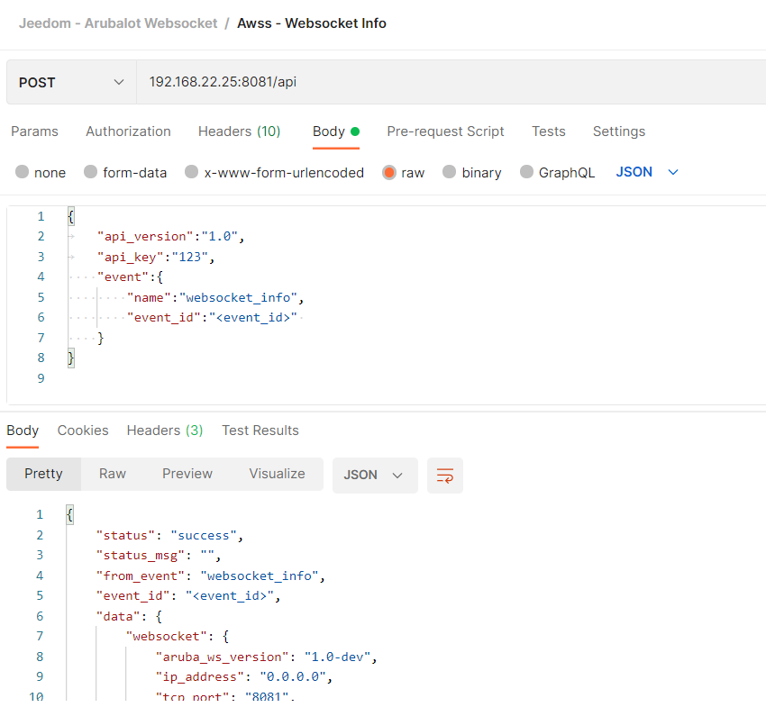

# Aruba Websocket Server (AWSS) JSON API


The Websocket Server can be accessed by JSON API, in order to monitor or configure some of the properties. The prefered access method should be through a websocket connection rather than regular HTTP connection.
Most of the actions triggered by the server are asymetric actions, by using a websocket connection, actions results can be send to client when they are ready.

The JSON API is accessible using URL : http://\<server_ip\>:\<port\>/api. If not customized, default value for \<port\> is 8081.

You can use tools like Postman (https://www.postman.com/) to try and test the APIs.




## General Format

General request format is :
```json
{
  "api_version":"1.0",        // mandatory : future use
  "api_key":"<api_key>",      // mandatory
  "event":{
    "name":"<event_name>",    // mandatory
    "event_id":"<event_id>",  // optional : uniq id to identifiy the request, used for async response like in websocket.
    "data": {                 // optional : event data depending on event
      "data_1":"value_1",
      "data_2":"value_2"
    }
  }
}
```

General response or notification format is :
```json
{
    "status": "success|fail",
    "status_msg": "<text_mesage>",
    "from_event": "<event_name>",
    "event_id": "<event_id>",
    "aruba_ws_version": "1.5",
    "data": {
      "data_1":"value_1",
      "data_2":"value_2"
    }
}
```


## API : Websocket Info

Get information regarding websocket status

Request :

```json
{
	"api_version":"1.0",
	"api_key":"<api_key>",
    "event": {
        "name":"websocket_info",
        "event_id":"<event_id>"
    }
}
```

Response (sample) :

```json
{
    "status": "success",
    "status_msg": "",
    "from_event": "websocket_info",
    "event_id": "<event_id>",
    "aruba_ws_version": "1.5",
    "data": {
        "websocket": {
            "aruba_ws_version": "1.5",
            "ip_address": "0.0.0.0",
            "tcp_port": "8081",
            "up_time": 1649240688,
            "presence_timeout": 90,
            "presence_min_rssi": -90,
            "presence_rssi_hysteresis": 5,
            "nearest_ap_hysteresis": 5,
            "nearest_ap_timeout": 90,
            "nearest_ap_min_rssi": -90,
            "reporters_allow_list": "",
            "access_token": "",
            "telemetry_max_timestamp": 60,
            "reporters_nb": 1,
            "devices_nb": 0,
            "include_mode": 1,
            "include_device_count": 0,
            "device_type_allow_list": "enocean:sensor,enocean:switch,unclassified:unclassified,unclassified:unclassified",
            "include_unclassified_with_local": 1,
            "include_unclassified_with_mac": 0,
            "include_unclassified_mac_prefix": "",
            "include_unclassified_max_devices": "5",
            "stats": {
                "payload_data": 2519,
                "raw_data": 5864
            },
            "gatt_queue_nb": 0
        }
    }
}

```

## API : Device List

Request :

```json
{
	"api_version":"1.0",
	"api_key":"123",
    "event":{
        "name":"device_list",
        "event_id":"<event_id>",
        "data": {
          "extended":1
        }
    }
}
```

Response (sample) :

```json
{
    "status": "success",
    "status_msg": "",
    "from_event": "device_list",
    "event_id": "<event_id>",
    "aruba_ws_version": "1.5",
    "data": {
        "devices": [
            {
                "mac": "A4:C1:38:07:FC:EE",
                "name": "ATC_07FCEE",
                "classname": "ATC:LYWSD03MMC",
                "classname_autolearn": false,
                "vendor_id": "ATC",
                "model_id": "LYWSD03MMC",
                "nearest_ap_mac": "BC:9F:E4:CA:6D:3A",
                "rssi": -72,
                "nearest_ap_last_seen": 1649244487,
                "vendor_name": "",
                "local_name": "ATC_07FCEE",
                "model": "",
                "presence": 1,
                "connect_status": "disconnected",
                "is_connectable": "unknown",
                "is_discoverable": "unknown",
                "services": [],
                "telemetry_values": {
                    "temperatureC": {
                        "name": "temperatureC",
                        "type": "",
                        "value": 18.9,
                        "timestamp": 1649240822
                    },
                    "humidity": {
                        "name": "humidity",
                        "type": "",
                        "value": 44,
                        "timestamp": 1649240788
                    }
                },
                "battery": {
                    "value": 48,
                    "timestamp": 1649240847
                }
            },
            {
                "mac": "E5:00:00:00:03:F7",
                "name": "EnOcean-Sensor (00:03:F7)",
                "classname": "enocean:sensor",
                "classname_autolearn": true,
                "vendor_id": "enocean",
                "model_id": "sensor",
                "nearest_ap_mac": "BC:9F:E4:CA:6D:3A",
                "rssi": -49,
                "nearest_ap_last_seen": 1649244469,
                "vendor_name": "",
                "local_name": "",
                "model": "",
                "presence": 1,
                "connect_status": "disconnected",
                "is_connectable": "unknown",
                "is_discoverable": "unknown",
                "services": [],
                "telemetry_values": {
                    "illumination": {
                        "name": "illumination",
                        "type": "",
                        "value": 16,
                        "timestamp": 1649240846
                    },
                    "occupancy": {
                        "name": "occupancy",
                        "type": "",
                        "value": 0,
                        "timestamp": 1649240846
                    }
                },
                "battery": {
                    "value": 99,
                    "timestamp": 1649240848
                }
            }
        ]
    }
}
```

## API : Device Info


Request :

```json
{
	"api_version":"1.0",
	"api_key":"123",
    "event":{
        "name":"device_info",
        "event_id":"<event_id>",
        "data": {
          "device_mac":"E5:00:00:00:03:F7"
        }
    }
}
```

Response (sample) :

```json
{
    "status": "success",
    "status_msg": "",
    "from_event": "device_info",
    "event_id": "<event_id>",
    "aruba_ws_version": "1.5",
    "data": {
        "device_mac": "E5:00:00:00:03:F7",
        "device": {
            "mac": "E5:00:00:00:03:F7",
            "name": "EnOcean-Sensor (00:03:F7)",
            "classname": "enocean:sensor",
            "classname_autolearn": true,
            "vendor_id": "enocean",
            "model_id": "sensor",
            "nearest_ap_mac": "BC:9F:E4:CA:6D:3A",
            "rssi": -48,
            "nearest_ap_last_seen": 1649244788,
            "vendor_name": "",
            "local_name": "",
            "model": "",
            "presence": 1,
            "connect_status": "disconnected",
            "is_connectable": "unknown",
            "is_discoverable": "unknown",
            "services": [],
            "telemetry_values": {
                "illumination": {
                    "name": "illumination",
                    "type": "",
                    "value": 16,
                    "timestamp": 1649241116
                },
                "occupancy": {
                    "name": "occupancy",
                    "type": "",
                    "value": 50,
                    "timestamp": 1649241148
                }
            },
            "battery": {
                "value": 99,
                "timestamp": 1649241148
            }
        }
    }
}
```


## API : Reporters List


Request :

```json
{
	"api_version":"1.0",
	"api_key":"123",
    "event":{
        "name":"reporter_list",
        "event_id":"<event_id>"
    }
}
```

Response (sample) :

```json
{
    "status": "success",
    "status_msg": "",
    "from_event": "reporter_list",
    "event_id": "<event_id>",
    "aruba_ws_version": "1.5",
    "data": {
        "websocket": {
            "aruba_ws_version": "1.5",
            "ip_address": "0.0.0.0",
            "tcp_port": "8081",
            "up_time": 1649240688,
            "presence_timeout": 90,
            "presence_min_rssi": -90,
            "presence_rssi_hysteresis": 5,
            "nearest_ap_hysteresis": 5,
            "nearest_ap_timeout": 90,
            "nearest_ap_min_rssi": -90,
            "reporters_allow_list": "",
            "access_token": "",
            "telemetry_max_timestamp": 60,
            "reporters_nb": 3,
            "devices_nb": 6,
            "include_mode": 1,
            "include_device_count": 6,
            "device_type_allow_list": "enocean:sensor,enocean:switch,unclassified:unclassified,unclassified:unclassified",
            "include_unclassified_with_local": 1,
            "include_unclassified_with_mac": 0,
            "include_unclassified_mac_prefix": "",
            "include_unclassified_max_devices": 0,
            "stats": {
                "payload_data": 151285,
                "raw_data": 169139
            },
            "gatt_queue_nb": 0
        },
        "reporters": [
            {
                "mac": "9C:8C:D8:C9:39:9E",
                "name": "AP-515",
                "status": "active",
                "local_ip": "192.168.30.14",
                "remote_ip": "192.168.30.14",
                "model": "AP-515",
                "version": "8.9.0.3-8.9.0.3",
                "telemetry": true,
                "rtls": false,
                "serial": false,
                "zigbee": false,
                "lastseen": 1649241214,
                "uptime": 1649240700
            },
            {
                "mac": "BC:9F:E4:CA:6D:3A",
                "name": "AP-555",
                "status": "active",
                "local_ip": "192.168.30.16",
                "remote_ip": "192.168.22.6",
                "model": "AP-555",
                "version": "8.9.0.3",
                "telemetry": true,
                "rtls": false,
                "serial": false,
                "zigbee": false,
                "lastseen": 1649244849,
                "uptime": 1649240728
            },
            {
                "mac": "20:4C:03:34:44:4C",
                "name": "AP-303H",
                "status": "active",
                "local_ip": "192.168.30.15",
                "remote_ip": "192.168.22.6",
                "model": "AP-303H",
                "version": "8.9.0.3",
                "telemetry": true,
                "rtls": false,
                "serial": false,
                "zigbee": false,
                "lastseen": 1649244852,
                "uptime": 1649240731
            }
        ]
    }
}
```


## API : Reporter Infos


Request :

```json


```

Response (sample) :

```json


```


## API : Device Include Mode


Request :

```json
{
    "api_version": "1.0",
    "api_key": "123",
    "event": {
        "name": "include_mode",
        "event_id":"<event_id>",
        "data": {
            "state": 1,
            "type": "enocean:sensor,enocean:switch,unclassified:unclassified,unclassified:unclassified",
            "unclassified_with_local": 1,
            "unclassified_with_mac": 1,
            "unclassified_mac_prefix": "E4:E5:E6",
            "unclassified_max_devices": "5"
        }
    }
}
```

Response (sample) :

```json
{
    "status": "success",
    "status_msg": "",
    "from_event": "include_mode",
    "event_id": "<event_id>",
    "aruba_ws_version": "1.5",
    "data": {
        "state": 1
    }
}
```


## API : Device Include Count


Request :

```json


```

Response (sample) :

```json


```

---

## API : Add / Remove Notification

Supported notification types are :
- reporter_status : no attributes
- device_status : mandatory device_mac attribute
- device_add : no attributes

Add Request :

```json
{
    "api_version": "1.0",
    "api_key": "123",
    "event": {
        "name": "notification_add",
        "data": {
            "type": "device_status",
            "device_mac": "A4:C1:38:D6:DF:51"
        }
    }
}
```

Remove Request :

```json
{
    "api_version": "1.0",
    "api_key": "123",
    "event": {
        "name": "notification_remove",
        "data": {
            "type": "device_status",
            "device_mac": "E9:46:B0:1C:DA:92"
        }
    }
}
```

Response (sample) :

```json
{
    "status": "success",
    "status_msg": "",
    "from_event": "notification_add",
    "event_id": "",
    "aruba_ws_version": "1.5",
    "data": {
        "type": "device_status"
    }
}
```

---

[Back to Readme](../README.md)
